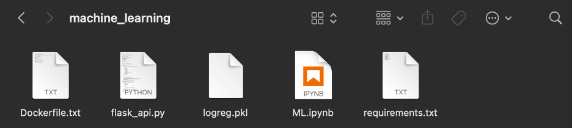
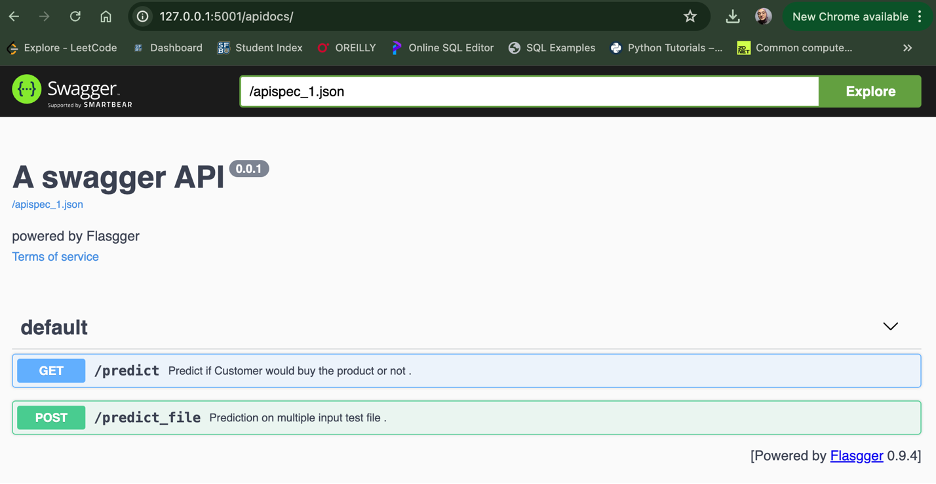

# Machine-Learning-on-Kubernetes

# Week 10 Homework 1: Machine Learning on Kubernetes

## Step 1: Set up a Functional Kubernetes Cluster

1. Open GKE terminal.

2. Create a Kubernetes cluster with three nodes using the following command:

    ```sh
    gcloud container clusters create kubia \
        --num-nodes=3 \
        --machine-type=n1-standard-1 \
        --region=us-west1-b
    ```

3. Check if nodes are correctly created:

    ```sh
    kubectl get nodes
    ```

## Step 2: Machine Learning Deployment using Docker

Implement the following steps on your local machine:

1. Create a local directory.

2. Put the following files into your directory:

    - [Source for files](https://github.com/HasnaeTalibi/Machine-Learning-Deployment-using-Docker/tree/main)



3. Build a Docker image:

    a. Turn on your Docker app on your local computer.
    
    b. Use the following command to build an image:

        ```sh
        docker build -t ml_app_docker .
        ```

4. Initiate the container to run our ML app:

    ```sh
    docker run -p 5001:5000 ml_app_docker
    ```

    To access the app, go to [http://127.0.0.1:5001/apidocs](http://127.0.0.1:5001/apidocs) to load the Swagger UI page.



5. Push the image to your Docker Hub:

    a. Login to your Docker Hub:

        ```sh
        docker login
        ```

    b. Tag the image "ml_app_docker" as latest:

        ```sh
        docker tag ml_app_docker yourdockerhubusername/yourrepositoryname
        docker tag ml_app_docker zeynepsalihoglu99/ml_app_docker:latest
        ```

    c. Push the image to Docker Hub:

        ```sh
        docker push yourdockerhubusername/yourrepositoryname:latest
        docker push zeynepsalihoglu99/ml_app_docker:latest
        ```

6. Stop the container:

    ```sh
    docker ps
    ```

    If you can’t see any container here, list all containers using this command:

    ```sh
    docker ps -a
    ```

    Then, remove containers with this command:

    ```sh
    docker rm <container_id>
    docker rm 8fb70624af22 3ea2d9d4301f 3ce2592c8be9 8f1175c07f01
    ```

## Step 3: Deploy your ML App to GKE

Use the GKE we created in Step 1.

1. Create a `deployment.yaml` file with the following contents:

    ```yaml
    apiVersion: apps/v1
    kind: Deployment
    metadata:
      name: ml-app-deployment
    spec:
      replicas: 1
      selector:
        matchLabels:
          app: ml-app
      template:
        metadata:
          labels:
            app: ml-app
        spec:
          containers:
          - name: ml-app-container
            image: ruichencn/w10hw1
            ports:
            - containerPort: 5000
    ```

2. Create the deployment with the above file:

    ```sh
    kubectl apply -f deployment.yaml
    ```

3. Wait a couple of minutes and list all the pods created:

    ```sh
    kubectl get pods
    ```

4. Create a `service.yaml` file.

    ```yaml
    apiVersion: vl 
    kind: Service 
    metadata:
      name: ml-app-service 
    spec:
      selector:
        app: ml-app 
      ports:
      - protocol: TCP
        port: 80
        targetPort: 5001
      type: LoadBalancer
    ```

5. Create the service with the above file:

    ```sh
    kubectl apply -f service.yaml
    ```

6. Get the service external IP:

    ```sh
    kubectl get svc
    ```

7. Access using the browser:

    ```sh
    external-ip/apidocs
    ```


---
